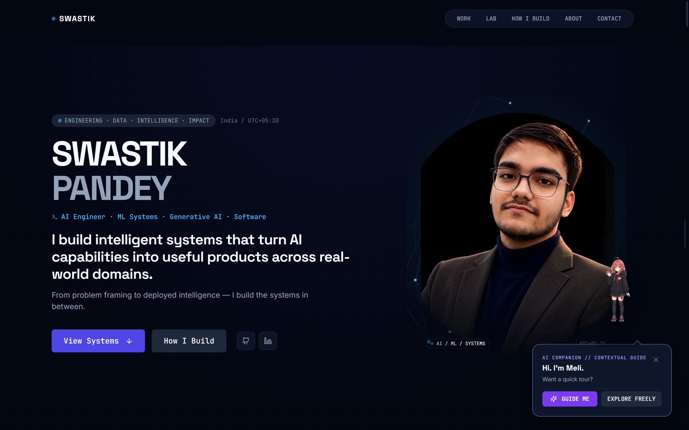
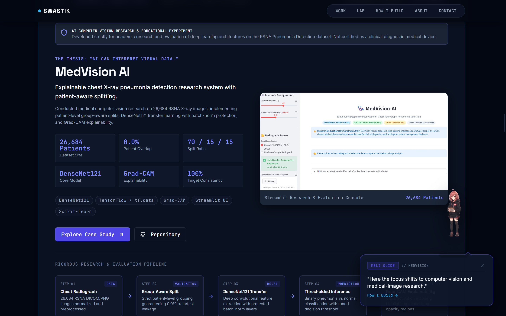
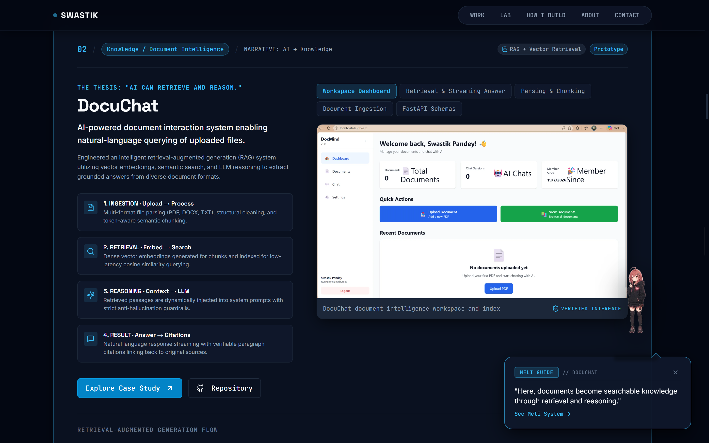
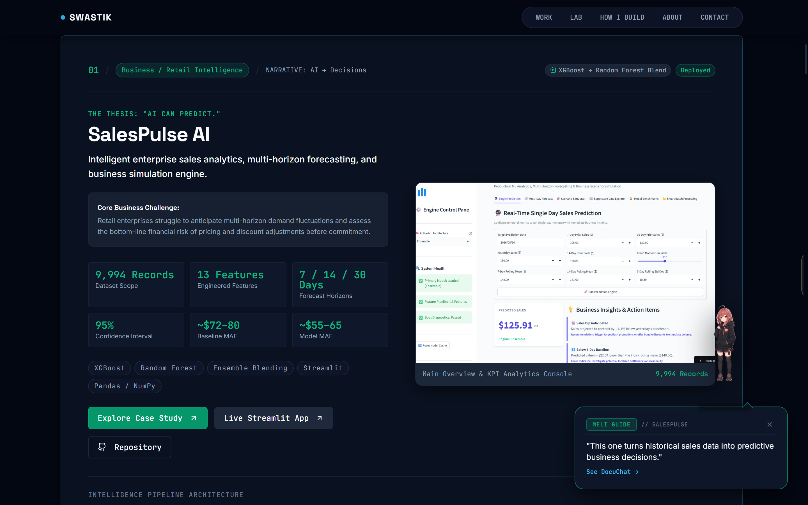
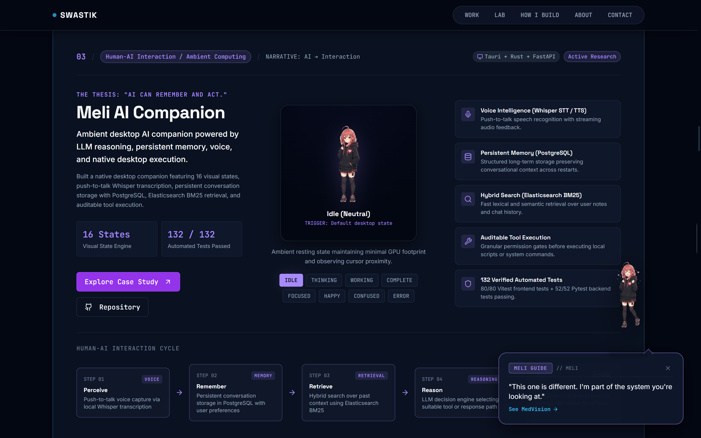

# Swastik Pandey — AI Systems & Software Engineering

> **"I build intelligent systems that turn AI capabilities into useful products across real-world domains."**

[](https://swastik-pandey-portfolio.swastikpandey1024.workers.dev)
[](https://github.com/SwastikPandey1024)
[](https://www.linkedin.com/in/swastik-pandey-a02719297/)
[](mailto:swastikpandey1024@gmail.com)

[](https://github.com/SwastikPandey1024/swastik-pandey-portfolio)
[](https://github.com/SwastikPandey1024/swastik-pandey-portfolio)
[](https://github.com/SwastikPandey1024/swastik-pandey-portfolio)

---

## 🌐 Experience the Interactive Live Portfolio

> **Experience the living, interactive version of this portfolio with AI companion guide Meli, real-time telemetry, and dynamic Grad-CAM / RAG evidence viewports:**
>
> ### **[👉 Launch Live Production Portfolio: swastik-pandey-portfolio.swastikpandey1024.workers.dev](https://swastik-pandey-portfolio.swastikpandey1024.workers.dev)**

[](https://swastik-pandey-portfolio.swastikpandey1024.workers.dev)

---

## 🧭 Narrative Arc & Interactive Chapters

The portfolio is structured around a central narrative arc demonstrating how artificial intelligence transitions from raw mathematical capability into verifiable, production-grade software:

```
  [ 01 // PREDICT ]             [ 02 // REASON ]             [ 03 // REMEMBER ]             [ 04 // INTERPRET ]
    SalesPulse AI      ───►        DocuChat        ───►      Meli Companion       ───►        MedVision AI
 (Tabular & Forecase)        (RAG & Document Intel)        (Voice & Desktop Shell)        (Medical Computer Vision)
```

| Chapter | Core Engineering Thesis | Flagship System | Live Portfolio Walkthrough |
| :--- | :--- | :--- | :--- |
| **Chapter 01** | *"AI can predict."* | **SalesPulse AI** | [**Explore Chapter 01 Live →**](https://swastik-pandey-portfolio.swastikpandey1024.workers.dev/#salespulse) |
| **Chapter 02** | *"AI can retrieve and reason."* | **DocuChat** | [**Explore Chapter 02 Live →**](https://swastik-pandey-portfolio.swastikpandey1024.workers.dev/#docuchat) |
| **Chapter 03** | *"AI can remember and act."* | **Meli AI Companion** | [**Explore Chapter 03 Live →**](https://swastik-pandey-portfolio.swastikpandey1024.workers.dev/#meli) |
| **Chapter 04** | *"AI can interpret visual data."* | **MedVision AI** | [**Explore Chapter 04 Live →**](https://swastik-pandey-portfolio.swastikpandey1024.workers.dev/#medvision) |
| **Chapter 05** | *"How I Build (9-Stage Lifecycle)"* | **Engineering Workflow** | [**Explore Workflow Live →**](https://swastik-pandey-portfolio.swastikpandey1024.workers.dev/#how-i-build) |
| **Chapter 06** | *"Technical Lab & Prototypes"* | **Open-Source Lab** | [**Explore Lab Archive Live →**](https://swastik-pandey-portfolio.swastikpandey1024.workers.dev/#lab) |
| **Chapter 07** | *"About & Engineering Philosophy"* | **Philosophy & Background** | [**Read About & Philosophy Live →**](https://swastik-pandey-portfolio.swastikpandey1024.workers.dev/#about) |

---

## 💡 About Me & Engineering Philosophy

I am an **AI Engineer & Software Builder** focused on the end-to-end continuum: from problem framing and data curation to deep learning architectures, API services, and high-performance interactive interfaces.

My engineering philosophy centers on **rigorous empirical validation**:
- **Leakage-Free Validation:** Strict patient-level and chronological splitting discipline across ML datasets to guarantee zero data leakage.
- **Explainable Intelligence:** Transparent spatial activations (Grad-CAM) and uncertainty intervals (95% confidence bands) to prevent black-box failures.
- **Production Craftsmanship:** Clean TypeScript architecture, responsive design, sub-second edge deployment, and 100% automated test coverage.

---

## 🚀 Featured Flagship Systems

### 01 // MedVision AI — Explainable Medical Computer Vision
*Explainable chest X-ray pneumonia detection research system with patient-aware splitting.*

[](https://swastik-pandey-portfolio.swastikpandey1024.workers.dev/#medvision)

- **Core Thesis:** *"AI can interpret visual data."*
- **Key Evidence:** Evaluated across **26,684 patient radiographs** with **0.0% patient data leakage** (strict group-aware 70/15/15 split). Fine-tuned **DenseNet121** with batch-norm preservation and **Grad-CAM saliency mapping** for spatial verification of lung opacities.
- **Stack:** DenseNet121, TensorFlow, Grad-CAM, Scikit-Learn, Streamlit.
- **Live Storytelling:** [**Interactive MedVision Case Study on Portfolio →**](https://swastik-pandey-portfolio.swastikpandey1024.workers.dev/#medvision)
- **Repository:** [GitHub / MedVision-AI](https://github.com/SwastikPandey1024/MedVision-AI)

---

### 02 // DocuChat — Document Intelligence & RAG System
*AI-powered document interaction system enabling natural-language querying of uploaded files.*

[](https://swastik-pandey-portfolio.swastikpandey1024.workers.dev/#docuchat)

- **Core Thesis:** *"AI can retrieve and reason."*
- **Key Evidence:** Multi-format document parser (PDF, DOCX, TXT), dense vector embeddings, cosine similarity index, and LLM reasoning with verbatim paragraph citations.
- **Stack:** LLM Context Reasoning, Vector Embeddings, Semantic Search, FastAPI REST, React, Dark Mode UI.
- **Live Storytelling:** [**Interactive DocuChat Case Study on Portfolio →**](https://swastik-pandey-portfolio.swastikpandey1024.workers.dev/#docuchat)
- **Repository:** [GitHub / DocMind](https://github.com/SwastikPandey1024/DocMind)

---

### 03 // SalesPulse AI — Enterprise Predictive Intelligence
*Multi-horizon sales forecasting, uncertainty estimation, and business decision simulator.*

[](https://swastik-pandey-portfolio.swastikpandey1024.workers.dev/#salespulse)

- **Core Thesis:** *"AI can predict."*
- **Key Evidence:** Engineered 13 temporal and category features across **9,994 retail records**, training weighted **XGBoost + Random Forest ensemble models** to reduce error from ~$72–80 baseline to **~$55–65 MAE** with **95% prediction intervals**.
- **Stack:** XGBoost, Random Forest, Weighted Blending, Streamlit, Pandas, NumPy.
- **Live Storytelling:** [**Interactive SalesPulse Case Study on Portfolio →**](https://swastik-pandey-portfolio.swastikpandey1024.workers.dev/#salespulse)
- **Live App & Repo:** [Live Streamlit App](https://salespulseai.streamlit.app) · [GitHub / SalesPulse_AI](https://github.com/SwastikPandey1024/SalesPulse_AI)

---

### 04 // Meli AI Companion — Ambient Desktop Interaction
*Ambient desktop AI companion powered by persistent memory, voice, and native desktop execution.*

[](https://swastik-pandey-portfolio.swastikpandey1024.workers.dev/#meli)

- **Core Thesis:** *"AI can remember and act."*
- **Key Evidence:** 16 visual character states, local push-to-talk **Whisper STT**, persistent conversation history in **PostgreSQL**, hybrid BM25 retrieval via **Elasticsearch**, and sandboxed tool execution in **Tauri/Rust**. Verified with **132 automated unit tests** (80 UI + 52 API).
- **Stack:** Tauri / Rust, Whisper STT, PostgreSQL, Elasticsearch BM25, React, FastAPI.
- **Live Storytelling:** [**Interactive Meli Case Study on Portfolio →**](https://swastik-pandey-portfolio.swastikpandey1024.workers.dev/#meli)
- **Repository:** [GitHub / meli-ambient-ai-companion](https://github.com/SwastikPandey1024/meli-ambient-ai-companion)

---

### 05 // Additional Engineering & Open Source Projects

| Project | Domain | Architecture / Highlights | Interactive Links |
| :--- | :--- | :--- | :--- |
| **GridCast AI** | Time-Series Forecasting | Electricity demand forecasting with DST-aware temporal engineering, XGBoost, and leak-free chronological validation. $R^2 = 0.9960$. | [Live App](https://gridcastai.streamlit.app) · [Repo](https://github.com/SwastikPandey1024/-GridCast-AI) · [Lab on Portfolio](https://swastik-pandey-portfolio.swastikpandey1024.workers.dev/#lab) |
| **AI CyberShield** | Cybersecurity AI | Network intrusion threat detection trained on 2.57M clean CICIDS2017 events. 99.88% Accuracy, 0.9637 Macro F1. | [Live App](https://ai-cybershield-zkw3.onrender.com) · [Repo](https://github.com/SwastikPandey1024/AI-CyberShield) · [Lab on Portfolio](https://swastik-pandey-portfolio.swastikpandey1024.workers.dev/#lab) |
| **TriviaPay** | FinTech / Blockchain | Campus peer-to-peer digital wallet with Algorand smart contracts for verifiable settlement. | [Repo](https://github.com/SwastikPandey1024/TriviaPay_Project) · [Lab on Portfolio](https://swastik-pandey-portfolio.swastikpandey1024.workers.dev/#lab) |

---

## 🛠️ Technical Stack & Capabilities

```
├── Machine Learning & AI
│   ├── Computer Vision: DenseNet121, CNN Transfer Learning, Grad-CAM Saliency
│   ├── Tabular & Time-Series: XGBoost, Random Forest, Blended Ensembling, Lag Feature Engineering
│   ├── NLP & LLMs: RAG Architecture, Dense Vector Embeddings, Semantic Search, Whisper STT
│   └── Frameworks: TensorFlow, Scikit-Learn, Pandas, NumPy
│
├── Full-Stack & Systems Engineering
│   ├── Frontend: TypeScript, React 19, TailwindCSS, Framer Motion, Three.js, Lucide Icons
│   ├── Backend & APIs: Python, FastAPI (Async / REST / Swagger), Flask
│   ├── Desktop & Native: Tauri, Rust Native Shell
│   ├── Data Stores: PostgreSQL, Elasticsearch (BM25), Vector Databases
│   └── Tooling & Quality: Vite, Vitest, ESLint, PostCSS, Git
```

---

## 🏗️ How I Build — Engineering Lifecycle

```
[ Problem Framing ] ──► [ Architecture Design ] ──► [ Data Ingestion & Splits ]
                                                              │
[ Inference & Decision ] ◄── [ Backend API & UI ] ◄── [ Model Training & Validation ]
```

> **Explore the interactive 9-stage engineering workflow visualizer live on the portfolio:**  
> **[👉 Explore "How I Build" on Portfolio](https://swastik-pandey-portfolio.swastikpandey1024.workers.dev/#how-i-build)**

1. **Problem Framing:** Clarify underlying domain constraints, objectives, and success criteria.
2. **Architecture Design:** Establish clear interface boundaries between data, inference, and UI layers.
3. **Data Ingestion & Splits:** Implement leak-free grouping (patient-level / chronological) before feature extraction.
4. **Model Training & Validation:** Train baselines, tune hyperparameters, and log comprehensive ROC/PR/MAE metrics.
5. **Backend & UI Integration:** Expose typed REST endpoints and construct intuitive, accessible interfaces.
6. **Verification & Testing:** Enforce 100% test passing rates with automated unit, integration, and a11y tests.

---

## 💻 Local Development & Build

### Prerequisites
- Node.js `18.x` or higher
- npm `9.x` or higher

### 1. Clone & Install
```bash
git clone https://github.com/SwastikPandey1024/swastik-pandey-portfolio.git
cd swastik-pandey-portfolio
npm install
```

### 2. Start Development Server
```bash
npm run dev
```

### 3. Run Verification Suite
```bash
# Run unit & integration test suites (49 passing tests)
npm run test

# Run ESLint static analysis (0 warnings)
npm run lint

# Production build bundle
npm run build
```

---

## 📬 Contact & Connect

- **Live Production Portfolio:** [https://swastik-pandey-portfolio.swastikpandey1024.workers.dev](https://swastik-pandey-portfolio.swastikpandey1024.workers.dev)
- **Primary Email:** [swastikpandey1024@gmail.com](mailto:swastikpandey1024@gmail.com)
- **Secondary Email:** [buildwithswastik9@gmail.com](mailto:buildwithswastik9@gmail.com)
- **LinkedIn:** [linkedin.com/in/swastik-pandey-a02719297](https://www.linkedin.com/in/swastik-pandey-a02719297/)
- **GitHub:** [github.com/SwastikPandey1024](https://github.com/SwastikPandey1024)
